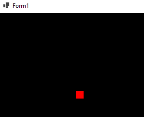

## MovePlayer

> we gaan nu een speler object besturen met rekenen en if statements

- open de solution `MovePlayer.sln`


## 1)

- open `Form1.cs`
- bekijk deze code:
    ```CSharp
        player.x += playerSpeed * frametime;//speler naar rechts
        player.y += playerSpeed * frametime;//speler naar onderen
    ```
    - bedenk je hoe je de speler de andere kant op kan laten lopen

- zoek:
    - //0)
        - zie je die booleans? die worden op true of false gezet als je W,S,A,D indrukt
            - zoek dat stuk zelf in de code

    - // 1)  
        - zorg ervoor dat je TEST (if) of de speler een richting in moet bewegen 
            > (bv of up true is)
        - dan in de {} van die if zet je de de JUISTE code (staat boven in deze file).
        - let op, je moet soms de += en soms de -= gebruiken!

## testen

- start de applicatie op
- je ziet nu dit:
> 
- druk op de W,S,A,D toetsen en beweeg de speler
    - de speler beweegt
    > 

## klaar

- commit & push naar je github        